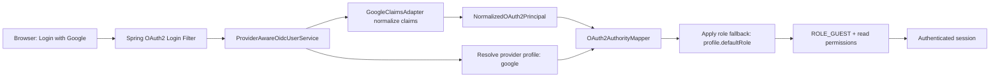
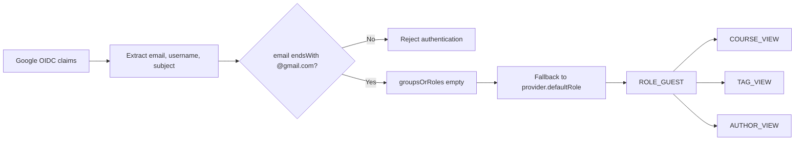

# Google OAuth2 Guest Access Design

Date: 2026-04-25
Status: Approved for planning
Scope: Add Google as an OAuth2 provider and assign read-only guest access for valid Gmail users.

## 1. Goal

Enable login with Google accounts and grant accepted Gmail users read-only access to the course application.

Accepted Gmail users receive `ROLE_GUEST` automatically.

`ROLE_GUEST` permissions:
- `COURSE_VIEW`
- `TAG_VIEW`
- `AUTHOR_VIEW`

## 2. Non-Goals

- No user allowlist in this phase.
- No dynamic role selection per user.
- No frontend redesign of auth flows.
- No replacement of existing auth providers (legacy session login and Keycloak remain supported).

## 3. Current Context

The backend already supports multi-provider OAuth2 normalization via:
- `ProviderAwareOidcUserService`
- `OAuth2ClaimsAdapter`
- `OAuth2AuthorityMapper`
- Provider metadata in `app.oauth2.providers[*]`

Current providers: Azure AD and Keycloak.

## 4. Chosen Approach

Use per-provider default role (Approach B):

1. Add Google provider profile in configuration.
2. Add `defaultRole` to provider profile metadata.
3. Update authority mapping fallback to use provider-specific default role.
4. Add Google claims adapter to normalize identity claims.
5. Enforce Gmail-domain acceptance rule (`@gmail.com`) for Google identities.
6. Add DB migration for `ROLE_GUEST` and `AUTHOR_VIEW` permission mapping.

This approach is selected because it is scalable for future providers that should receive different default roles.

## 5. Architecture

## 6. Data Flow and Authorization Rules

Rules:
- Google login is accepted only for valid Gmail addresses (`@gmail.com`, case-insensitive domain check).
- Accepted Google users are always assigned `ROLE_GUEST` in this phase.
- Provider role claims from Google are not required.

## 7. Component-Level Design

### 7.1 Configuration Model

Change `OAuth2ProviderProfile`:
- Add `defaultRole: String? = null`

Purpose:
- Allow per-provider role fallback when role claims are missing.

### 7.2 Authority Mapping

Change `OAuth2AuthorityMapper`:
- Fallback role logic changes from global hardcoded default to provider-aware default.

Behavior:
- If normalized roles are empty:
  - Use `profile.defaultRole` when present.
  - Otherwise fallback to existing default (`ROLE_USER`) for backward compatibility.

### 7.3 OIDC User Service

Change `ProviderAwareOidcUserService` and mapper invocation contract:
- Pass resolved provider profile into authority mapping.

Purpose:
- Enable provider-specific default role assignment.

### 7.4 Google Claims Adapter

Add `GoogleClaimsAdapter` implementing `OAuth2ClaimsAdapter`:
- `providerId = "google"`
- Normalizes:
  - `subject` from `sub`
  - `username` from preferred claim order (`name`, then `email`, then `sub`)
  - `email` from `email` claim
  - `groupsOrRoles = emptyList()`

Validation rule:
- Accept only `@gmail.com` addresses using a case-insensitive check.
- Reject non-Gmail domain addresses.

### 7.5 Security Configuration Wiring

Change `SecurityConfig`:
- Register and include `GoogleClaimsAdapter` in `oauth2ClaimsAdapters()` map.

No other filter-chain behavior changes are required.

### 7.6 Application Properties

Add provider metadata for Google in `application.properties`:
- `app.oauth2.providers[n].provider-id=google`
- `app.oauth2.providers[n].display-name=Google`
- `app.oauth2.providers[n].issuer-uri=https://accounts.google.com`
- `app.oauth2.providers[n].username-claims=name,email,sub`
- `app.oauth2.providers[n].email-claims=email`
- `app.oauth2.providers[n].role-claims=` (empty)
- `app.oauth2.providers[n].default-role=ROLE_GUEST`

Add OAuth2 client registration/provider properties:
- `spring.security.oauth2.client.registration.google.*`
- `spring.security.oauth2.client.provider.google.*`

Environment variables:
- `GOOGLE_CLIENT_ID`
- `GOOGLE_CLIENT_SECRET`

## 8. Database Design

Add one Flyway migration:
- `V6__add_role_guest_and_author_view_permission.sql`

Migration responsibilities:
1. Insert `ROLE_GUEST` role.
2. Insert `AUTHOR_VIEW` permission.
3. Map `ROLE_GUEST` to:
   - `COURSE_VIEW`
   - `TAG_VIEW`
   - `AUTHOR_VIEW`
4. Map `ROLE_ADMIN` to `AUTHOR_VIEW` for consistency.

Idempotency strategy:
- Use insert-if-not-exists pattern compatible with existing migration style.

## 9. Error Handling

- Unsupported provider id: existing resolver exception remains.
- Missing/invalid Google email claim: reject authentication.
- Non-Gmail email: reject authentication.
- Missing Google client credentials: startup/configuration failure (fail fast).
- Guest user attempts edit endpoints: existing `@PreAuthorize` enforcement returns 403.

## 10. Testing Strategy

### Unit Tests

- `GoogleClaimsAdapterTest`
  - Normalizes valid Gmail claims.
  - Rejects non-Gmail addresses.
  - Uses fallback username behavior.

- `OAuth2AuthorityMapperTest`
  - Empty roles + `defaultRole=ROLE_GUEST` maps to guest permissions.
  - Backward compatibility when `defaultRole` absent.

- `OAuth2ProviderProfile` mapping test
  - Binds `default-role` property correctly.

### Integration Tests

- OAuth2 login flow test for Google registration id.
- Verify resulting authorities include:
  - `ROLE_GUEST`
  - `COURSE_VIEW`
  - `TAG_VIEW`
  - `AUTHOR_VIEW`
- Verify non-Gmail Google identity fails authentication.

### Migration Verification

- Application startup migration succeeds.
- Role/permission relationships created as expected.

## 11. Local Development Requirements

Google OAuth setup in GCP is required for real Google sign-in.

Required redirect URI:
- `http://localhost:8081/login/oauth2/code/google`

Local env vars must be supplied for client credentials.

## 12. Security and Operational Notes

- Gmail-domain check controls who can enter as guest in this phase.
- This is broad access by domain design; no allowlist currently.
- Consider future allowlist/domain policy abstraction if onboarding more external providers.

## 13. Rollout Plan

1. Add migration and backend code changes.
2. Add Google OAuth properties and local env docs.
3. Run backend tests and migration verification.
4. Validate end-to-end login with Gmail account in local environment.
5. Validate guest cannot access edit/managing endpoints.

## 14. Acceptance Criteria

- User can click/select Google provider and complete OAuth2 login.
- Valid Gmail user is authenticated and receives `ROLE_GUEST`.
- Guest can view courses/tags/authors.
- Guest cannot perform create/update/delete operations.
- Existing auth providers continue to work unchanged.
- Migration applies successfully on clean and existing databases.
